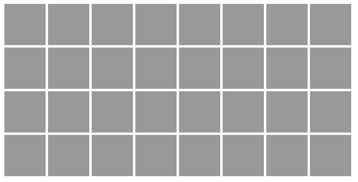

This week
=======
* Use more canvas APIs
* Discuss terms
	* variables
	* properties
	* method/function
	* parameters/arguments
	* strings
	* data types
	* Canvas
	* syntax
	* pseudo-code


Outline for day:
=======
* review console and jsfiddle
* terms from above
* walk through basic canvas APIs http://jsfiddle.net/phillipkerman/5TN4n/
	* help me draw some objects
	```ctx.fillRect(0,0,100,100);```
	```ctx.strokeRect(0,0,100,100);```
	```ctx.clearRect(0,0,100,100);```
	```ctx.fillStyle = '#ff0000';```
	```ctx.fillText("some string", 0,0);```
	```ctx.strokeStyle = 'red';```
	```ctx.lineWidth = 2;```
	```ctx.beginPath();```
	```ctx.moveTo(0,0);```
	```ctx.lineTo(100,100);```
	```ctx.stroke();```
	
* nice summary of canvas APIs http://www.nihilogic.dk/labs/canvas_sheet/HTML5_Canvas_Cheat_Sheet.pdf

* work out solutions to the following bugs
	* why is the box black (and not blue)? http://jsfiddle.net/phillipkerman/K3f9B/
	* why is the black box "in front of" the red box? http://jsfiddle.net/phillipkerman/D4ZuU/
	* why do I only see one box instead of two? http://jsfiddle.net/phillipkerman/bXqUa/ 
* using hexidecimal numbers to set color http://phillipkerman.com/cedaroak/hex/
* discuss events
	* see how to "listen" for mouse clicks http://jsfiddle.net/phillipkerman/RpMvY/
	* understand the typical game loop pattern http://jsfiddle.net/phillipkerman/LDCsB/

	
Advanced Topics:
=======
* selecting random item from array

```
var list = ["a", "b", "c"];

var randomIndex = Math.floor( Math.random()*list.length );

var randomItem = list[randomIndex];

console.log("random item " + randomItem);

```

* basic for-loop

```
//format
// for( init; condition; loop ) {}
for (var i=0; i<5; i++){
	console.log(i);
}
```

* nested for-loop

```
for (var row=0; row<5; row++){
	console.log("row " + row);
	for( var col=0; col<5; col++){
		console.log("row " + row + " col " + col);
	}
}
```
Challenges
=======

* use a loop to draw a ladder, sort of like this:


* challenge: use nested loops to draw a grid, like this:
