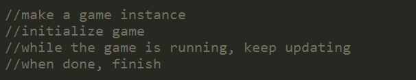
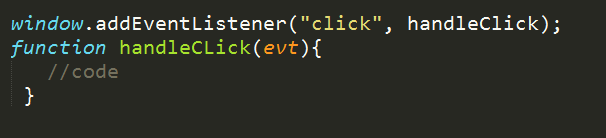

PLAN
=======
* share epiphanies, jokes, anything from between last class and this class.
* define: pseudo-code
	* you do this already
* understand game loop
* Basic Game Loop (in JavaScript):
* 
* Pseudo-code Game Loop:
* 
* Stubbed Game Loop:
* 
* Regular event listeners:
* 

* Today: Designing objects (or lists of objects--AKA "Arrays")
	* Understanding objects
	* See problem which can be solved with objects: http://jsfiddle.net/phillipkerman/yuaj8/
	* Make a person object
	* 
	* 
* See sequence of "problem" to "solution":
	* Using an object: http://jsfiddle.net/phillipkerman/wvF5x/
	* Multiple objects: http://jsfiddle.net/phillipkerman/Trhvz/
	* Using arrays: http://jsfiddle.net/phillipkerman/tfxfD/
* Homework will be about designing objects
	* think about how objects can have both properties and behaviors
* >>>Spring Break stuff<<<:
	* Video recap of this week: http://vimeo.com/62319185
	* JSFiddle of code above: http://jsfiddle.net/phillipkerman/tdfX6/
	* Video walkthrough of basic collision detection: http://vimeo.com/62363398
	* JSFiddle of code above: http://jsfiddle.net/phillipkerman/ebyqD/
	* Feel free to contact me with questions or additional challenges: phillipkerman@gmail.com

