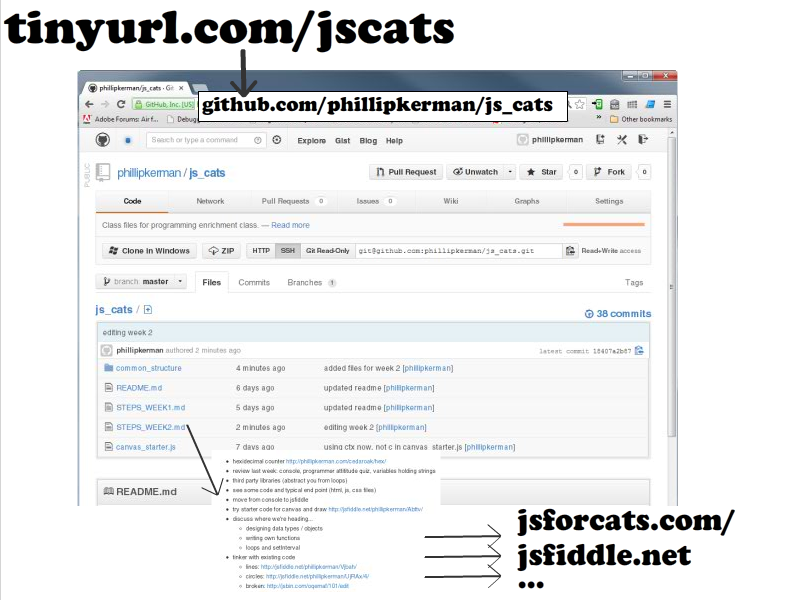

Plan
=======
* discuss class pattern: 10-15 minutes discussion, 30+ minutes at computer, 10 minute post mortem?
* discuss any epiphanies or ponderings
* see my 1GAM/February: http://phillipkerman.com/rando/
* vocabulary
* review jsfiddle vs. console (mention other tools)
* code movie
* remind tinyurl.com/jscats
* today
	* watch me make mistakes/fix them and learn about functions
	* set up event listeners to "listen" for clicks
	* link to event listener starter http://jsfiddle.net/phillipkerman/MB6RV/
	* link to canvas starter (and draw APIs) http://jsfiddle.net/phillipkerman/Abttv/
* coming up
	* designing data types / objects
	* arrays, loops, setInterval
* link to my jsfiddle with 

code.org (movie)
=======
* 5:44 version of "What Schools Don't Teach"  http://www.youtube.com/watch?v=nKIu9yen5nc
* interesting critical blog post/review (and very diverse comments as well!) http://symbo1ics.com/blog/?p=1615

Link Reminder
======

