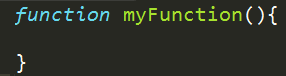

Plan
=======
* Share any epiphanies, ponderings, news, or even jokes about programming. (e.g. "Why did the programmer use all the shampoo?")
* Did anyone watch that code.org movie and/or read the blog review?
* I added this link to last week's STEPS file http://phillipkerman.com/rando/js/main.js
* Vocabulary so far: properties, methods, strings, concatenation.
	* property is like an attribute and always uses this _syntax_: `instance.property` or `instance.property=value` For example: `ctx.lineStyle='#ff0000';`
	* methods usually involve more work (and probably _invoke_ functions) but the easy way to spot them is their syntax: `instance.method()` Depending on the method, the parenthesis may also accept 1 or more _parameters_. For example: `ctx.clearRect(0,0,100,100);` 
* Recap of functions introduction.

* Example file which could use functions: https://github.com/phillipkerman/js_cats/tree/master/discuss_codes/functions.js

* MAIN THIS THIS WEEK: Think about data separately from code that draws. 
	* Example: http://jsfiddle.net/phillipkerman/Hb5fR/
* Promised link to tutorial on Sublime Text 2: https://tutsplus.com/course/improve-workflow-in-sublime-text-2/
* For next week: learn about custom objects 
	* Objects discussion: https://github.com/phillipkerman/js_cats/tree/master/discuss_codes/objects.js
	* Example: http://jsfiddle.net/phillipkerman/LCskf/2/
* Design/discuss data objects needed for a player vs. alien game
* Optional stuff to look at outside class
	* cannon http://jsfiddle.net/phillipkerman/SkNSj/
