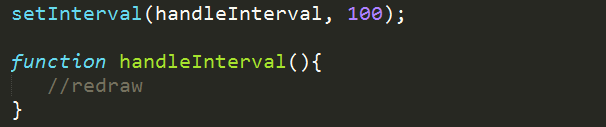
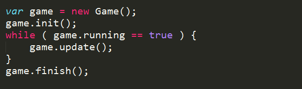
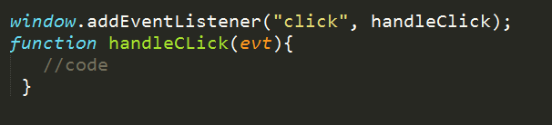

PLAN
=======
	--share epiphanies, jokes, anything from between last class and this class.
	--define: pseudo-code
		--already you do this
	--understand game loop
		--Basic Game Loop (in JavaScript):
	
		--Pseudo-code Game Loop:
	
		--Regular event listeners:
	
	--designing objects (and array)
	--homework to design objects
		--think objects have properties and behaviors

