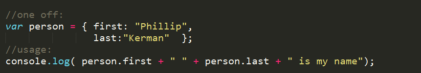
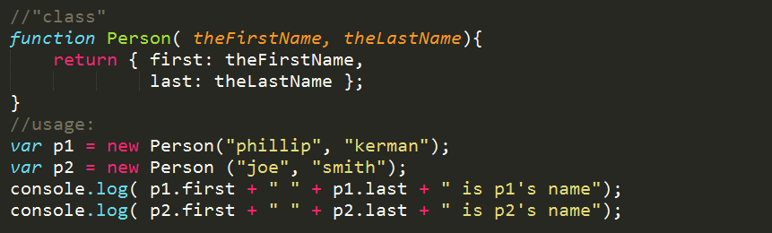

PLAN
=======
* share epiphanies, jokes, anything from between last class and this class.
* nice reference of canvas APIs http://www.nihilogic.dk/labs/canvas_sheet/HTML5_Canvas_Cheat_Sheet.png
* HTML5 Book with nice chapter on canvas (if you get an account, you can read it online via "Interactive Content"): http://www.apress.com/9781430238645
* See modulo 
	* no fuss wrap: http://jsfiddle.net/phillipkerman/edmXg/
	* odd/even: http://jsfiddle.net/phillipkerman/m8gTA/

Starter files (incomplete)
=======
* tic-tac-toe http://jsfiddle.net/phillipkerman/ntmGz/
* bounce http://jsfiddle.net/phillipkerman/FXcZW/ (was thinking something like this: http://phillipkerman.com/jscats/bounce.html)
* pong http://jsfiddle.net/phillipkerman/79Rdq/

Repeat of objects discussion
=======
* See problem which can be solved with objects: http://jsfiddle.net/phillipkerman/yuaj8/
* Make a person object
* 
* 